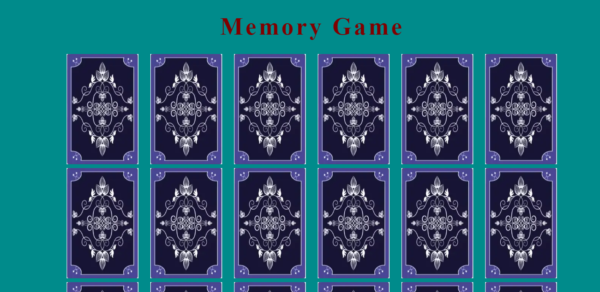

# Memory Game

The Memory Game is a relaxing game that involves matching randomly placed cards. Its main purpose is to help users unwind from their busy day-to-day lives, reducing stress and promoting relaxation.

Visit the deployed site here :[Medical History](https://dhruvesh48.github.io/memory-game/)

---

## User Experience - UX

---

### Initial Discussion

#### Key information for the site

- An introduction to Memory Game.
- Images of hidden cards.
- Images of playing cards.
- Click function to flip the cards.
- Alert user for incorrect cards.
- Alert user for correct cards.

---

### User Stories

---

#### Client Goals

- To be able to view the website and play on a variety of devices.
- To be able to interact with cards.
- To be able to select 2 cards.
- To be able to view their choices of the game(correct/incorrect).
- To be able to reset the game.

#### First Time Visitor Goals

- I want to play a relaxing game.
- I want to see the images and can interact.
- I want to be able tell if I got correct or incorrect answer.
- I want to be able to reset the game.

#### Returning Visitor Goals

- I want to play a relaxing game.
- I want to be able to play the game again.
  
#### Frequent Visitor Goals

- I want to see different possibilities of outcome everytime.

---

## Design

---

### Colour scheme

Memory Game colour palette

- The website uses background-color darkcyan(#008B8B), for the heading it uses #800000, and the reset button uses combination of 3 color #800000 for the background-color, #fff for the text and #000 for the box shadow .
- For alt text the default color of the browser is used.
- The colour scheme is consistent throughtout the whole website.

### Imagery  

---
All of the images used on this site is from the external websites which will be credited in the credit section.

## Features

---

### General Features of the page

---
The page of the website have :

- A favicon which is the centre part of the Memory Game.
- A title tells user what game it is.
- Images to interact.
- Alert user for their interaction.

#### Index Page

---
The Index Page is divided into four sections:

- The Title of the game
  - Featured at the top of the page, the memory game heading is easy to see for the user.

- The game section
  - This section will allow the user to play the memory game. The user will be able to see the back side of the card.
  - The user will be able to select any 2 cards and it will show which card the user have selected.

- Alert section
  - This is where the user receives an alert after they choose two cards, indicating whether they are correct, incorrect or if they selected the same card.

- The reset button
  - This is where the user can restart the game anytime they want and it will randomly place the cards again. 

#### Future Features

---

- Memory game will have scores added to the side game.
- It will have better css so the cards look like they are flipping.
- The website name will change instead of Memory Game.
- More simlar games will be added.
- On the main page user will have option to choose what game they want to play.
- New html page will be created letting user login into their account.

---

## Memory Game - TESTING DOCUMENTATION

---

## AUTOMATED TESTING
  
### W3C Validator

[W3C](https://validator.w3.org/) was used to validate HTML page, [CSS](https://jigsaw.w3.org/css-validator/#validate_by_uri) was used to validate css page, [JavaScript](https://jshint.com/) was used to validate JavaScript page.
  
- [Index page W3C HTML Validation](docs/html-checker.png) - Pass
- [style.css CSS Validation](docs/css-checker.png) - Pass
- [script.js JavaScript Validation](docs/javascript-validator.png) - Pass

---

### Lighthouse

Lighthouse from the Chrome Developer tools was used to test the performance, accessibility, best practices and SEO of each page on the website.

### Desktop Results

- Index page
  - There is a unfix bugs which is stated below in Unfixed Bugs

  

### Mobile Results

- Index page
  - 2 results in mobile and the bug is stated below in Unfixed Bugs

  
  

## Manual Testing

### Responsiveness

---

Each page has been inspected on variety of devices such as mobile, laptop, desktop. Moreover, they have been tested on multiple browser such as Google, Microsoft edge.

- Home page Mobile device
  

- Home page Desktop device
  

### Validation

- The Game section:
  - checking back-card image display on the game-section
  - clicking the image and display the play card
  - checking all alerts working
  - if correct then alert correct and display hidden
  - if incorrect then alert incorrect and display back-card image
  - if choosen the same card alert try again display back-card image

- The reset game button:
  - clicking the reset button and it should restart the game by reloading the website
  - after clicking the reset button it should change the background-color from #800000 to #fff

### Unfixed Bugs
- Poor performance by lighthouse:
  - The reason for the poor performance was large layout shift this is because the images keep changing by JavaScript as it is one of the feature of the game to randomise each card every game user play and so the layout shift occurs.

## Accessibility

---
Care has been taken throughout the coding to ensure that this website is as accessible friendly as possible. Particular attention has been given to the following points:

- Ensuring sufficient contrast between the text and its respective background.
- Using a box shadow color for the buttons and the text input fields.
- The use of accurate alt descriptions for the images used in the website.
- The css section is in alphabetically order for easier accessibility.
- JavaScript code well commented explaining all the commands that is carried out by script.js file

## Technologies used

#### Language used

HTML, CSS and JavaScript are the languages used on this website.

#### Frameworks, Libraries & Programs Used

- [Favicon.io](https://favicon.io/) - To create and download the favicon logo.
- [ui.dev](https://ui.dev/amiresponsive) - To create views of the website on different viewing devices.
- [W3C HTML validator](https://validator.w3.org/) - To validate all the HTML file.
- [W3C CSS validator](https://jigsaw.w3.org/css-validator/) - To validate CSS file.
- [JSHint JavaScript Validator](https://jshint.com/) - To validate JavaScript file.
- [Google Dev tools](https://developer.chrome.com/docs/) - to troubleshoot and test issues during the development.
- [MDN webdocs](https://developer.mozilla.org/en-US/) - reference
- [W3C schools](https://www.w3schools.com/) - for resolving code format in CSS and HTML.
- [Color Hunt](https://colorhunt.co/) - for choosing the color palettes.
- [Compress-or-Die](https://compress-or-die.com/webp) - for compressing the image and changing its format to webp.
- [Freepik](https://www.freepik.com/icon/memory-game_6168842) - for favicon icon image.

## Deployment

---
 This site was deployed using the following steps:

1. Open GitHub.
2. Select the project to be deployed.
3. Go to 'Settings'.
4. In the Code and Automation section, select Pages.
5. Set Source to 'Deploy from a branch'.
6. Select Main Branch.
7. Set Folder to 'Root'.
8. Under Branch click 'Save'
9. The link to the live website is now displayed at the top of the page.

### Local development

---

#### How to Fork

1. Log in to Github.
2. Go to the repository for this project.
3. At the top right of the page, click the "Fork" button. This will create a copy of the repository under your Github account.

#### How to clone

1. Log in to Github.
2. Go to the repository for this project.
3. Click on the "Code" button, select from HTTPS, SSH or Github CLI.
4. Copy the URL for the repository.
5. Open your terminal or command prompt.
6. Navigate to the directory where you want to clone your repository.
7. Use the `git clone` command followed by the URL that you have copied.

## Credits

### Media

- Index page(HTML)
  - Favicon of the memory game is from [Freepik](https://www.freepik.com/icon/memory-game_6168842)
  - Back-card image is from [Creative market](https://creativemarket.com/Sunny_Lion/29849-Playing-Card-Back-Designs?epik=dj0yJnU9UVZ0SlVvdUJMdWhxNi1hT01ZamdQS2VfX1daaVFTbGomcD0wJm49WjhfcWlSbGpSSVdIb0ZBcGQtSEdBdyZ0PUFBQUFBR1lJWTE4)
  - Ace playing card is from [wikimedia commons](https://commons.wikimedia.org/wiki/File:Aceofspades.svg)
  - Two playing card is from [wikimedia commons](https://commons.wikimedia.org/wiki/File:2_of_spades.svg)
  - Three playing card is from [wikimedia commons](https://commons.wikimedia.org/wiki/File:Playing_card_diamond_3.svg)
  - Four playing card is from [wikimedia commons](https://commons.wikimedia.org/wiki/File:Playing_card_club_4.svg)
  - Five playing card is from [wikimedia commons](https://commons.wikimedia.org/wiki/File:Playing_card_heart_5.svg)
  - Six playing card is from [wikimedia commons](https://commons.wikimedia.org/wiki/File:6_of_spades.svg)
  - Seven playing card is from [wikimedia commons](https://commons.wikimedia.org/wiki/File:Playing_card_heart_7.svg)
  - Eight playing card is from [wikimedia commons](https://commons.wikimedia.org/wiki/File:Playing_card_club_8.svg)
  - Nine playing card is from [wikimedia commons](https://commons.wikimedia.org/wiki/File:Playing_card_heart_9.svg)
  - Ten playing card is from [wikimedia commons](https://commons.wikimedia.org/wiki/File:Playing_card_spade_10.svg)
  - Jack playing card is from [wikimedia commons](https://commons.wikimedia.org/wiki/File:Jack_of_hearts.svg)
  - Queen playing card is from [wikimedia commons](https://commons.wikimedia.org/wiki/File:Queen_of_clubs.svg)
  - King playing card is from [wikimedia commons](https://commons.wikimedia.org/wiki/File:King_of_diamonds.svg)
  - window.location.reload() on line 20 is from [mdn web docs](https://developer.mozilla.org/en-US/docs/Web/API/Location/reload)

- JavScript(script.js)
  - function shuffleCards() on line 165 to 167 is from [JavaScript.info](https://javascript.info/task/shuffle)
  - setAttribute on line 156 is from [W3School](https://www.w3schools.com/jsref/met_element_setattribute.asp)
  - setTimeout on line 182 id from [W3School](https://www.w3schools.com/jsref/met_win_settimeout.asp)